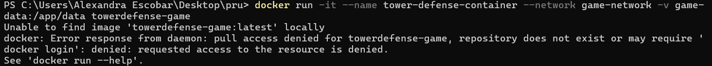
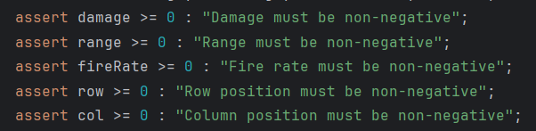

# Descripción del proyecto: V2
El juego Tower Defense es un videojuego de consola donde el jugador debe defender su base de oleadas
de enemigos colocando torres en lugares estratégicos del mapa. El proyecto incluirá el uso de mocks,
stubs y fakes para pruebas unitarias y de integración utilizando Mockito y pruebas de mutación.

Objetivos de la clase:
1. Configurar y ejecutar contenedores Docker.
2. Configurar redes y volúmenes en Docker.
3. Usardocker exec para interactuar con contenedores en ejecución.
4. Implementar aplicaciones con Docker Compose.
5. Desplegar aplicaciones en Kubernetes.
6. Realizar pruebas unitarias y de integración utilizando Mockito.
7. Implementar pruebas de mutación para verificar la calidad de las pruebas.

# 1. Configurar y ejecutar contenedores Docker.
### Configuración de docker
```
# Usar una imagen base de OpenJDK
FROM openjdk:21

# Establecer el directorio de trabajo dentro del contenedor
WORKDIR /app

# Copiar todo el contenido del directorio actual a /app en el contenedor
COPY . /app/

# Compilar todos los archivos Java en el directorio de origen
RUN javac src/main/java/org/example/*.java

# Definir el comando por defecto para ejecutar la aplicación
CMD ["java", "-cp", "src/main/java", "org.example.Game"]
```
Modificamos el Dockerfile original en RUN ira la dirección de los archivos java y * para indicar que todos los archivos en esa carpeta 


### Construcción de la imagen Docker
Este comando construye una imagen Docker a partir de un Dockerfile ubicado en el directorio actual 

```docker build -t tower-defense-game .```

Primero tenemos que abrir el docker desktop


### Ejecución del contenedor

Este comando ejecuta un contenedor a partir de la imagen tower-defense-game

```docker run -it --name tower-defense-container tower-defense-game```


# 2. Configurar redes y volúmenes en Docker.

## Crear una red personalizada

Este comando crea una red de Docker personalizada llamada game-network

```docker network create game-network```


## Ejecutar el contenedor en la red

Esta es una variación del comando anterior (docker run), pero especificando que el contenedor debe ejecutarse en la red game-network que creamos anteriormente.

```docker run -it --name tower-defense-container --network game-network tower-defense-game```

El error presentado es debido a que ya existe un contenedor con el mismo nombre debido a que se creo anteriormente.


```docker rm tower-defense-container```


La solución a esto es eliminar el contenedor y volver a ejecutar el comando anterior


## Crear y montar un Volumen

Este comando crea un volumen Docker llamado game-data. 

```docker volume create game-data```


 Aquí, se ejecuta un contenedor (towerdefense-game) especificando que el volumen game-data debe montarse en el directorio /app/data dentro del contenedor.

```docker run -it --name tower-defense-container --network game-network -v game-data:/app/data towerdefense-game```

Para solucionar este error debemos eliminar el contenedor nuevamente y volver a iniciarlo



```docker rm tower-defense-container```

En este caso use el id para ejecutarlo directamente y que no haya conflicto


```docker run -it --name tower-defense-container --network game-network -v game-data:/app/data e318f11cb88b2320c6ca6c89c99cdfd1bdc55ded682518df595a2b031a40fef6```


# 3. Usardocker exec para interactuar con contenedores en ejecución.
## Acceder al contenedor en ejecución

Este comando permite acceder a un contenedor en ejecución (tower-defense-container) y abrir una terminal interactiva dentro de él (/bin/bash).

```docker exec -it tower-defense-container /bin/bash```

El error generado es que una vez ejecutado el contenedor se cierra por ese motivo se debe modificar el dockerfile


Agregando las ultimas lineas indicamos que el contenedor no se cierre a pesar de que el juego haya terminado


## Ejecutar comandos dentro del contenedor

Este comando lista el contenido del directorio /app dentro del contenedor.

```ls /app```


# 4. Implementar aplicaciones con Docker Compose.
## Crear un archivo docker-compose.yml
```version: '3'
services:
 game:
 image: tower-defense-game
 networks:
 - game-network
 volumes:
 - game-data:/app/data
networks:
 game-network:
 driver: bridge
volumes:
 game-data:
 driver: local
 ```


## Iniciar los servicios

Se utiliza para iniciar todos los servicios definidos en tu archivo docker-compose.yml

```docker-compose up -d```


Este error se produce debido a que no esta bien estructurado el archivo


# 5. Desplegar aplicaciones en Kubernetes.
## Crear archivos de despliegue y servicio 
### deployment.yaml
```apiVersion: apps/v1
kind: Deployment
metadata:
 name: tower-defense-deployment
spec:
 replicas: 1
 selector:
 matchLabels:
 app: tower-defense-game
 template:
 metadata:
 labels:
 app: tower-defense-game
 spec:
 containers:
 - name: tower-defense-game
 image: tower-defense-game
 ports:
 - containerPort: 8080
 ```

### service.yaml
 ```
 yaml
apiVersion: v1
kind: Service
metadata:
 name: tower-defense-service
spec:
 selector:
 app: tower-defense-game
 ports:
 - protocol: TCP
 port: 80
 targetPort: 8080
 type: LoadBalancer 
 ```
 

### Aplicar los archivos de configuración en Kubernetes

Este comando aplica la configuración definida en el archivo deployment.yaml en el clúster de Kubernetes.

 ```kubectl apply -f deployment.yaml ```


Este comando aplica la configuración definida en el archivo service.yaml en el clúster de Kubernetes. 

 ```kubectl apply -f service.yaml ```


### Verificar el estado del despliegue

Este comando muestra el estado actual de todos los pods en tu clúster de Kubernetes.

 ```kubectl get pods ```


 Este comando muestra el estado actual de todos los servicios en tu clúster de Kubernetes.

 ```kubectl get services ```


# Ejercicio 1: Configuración y uso de docker (3 puntos)
## Teoría:
- Describe los principios fundamentales de los contenedores Docker y su arquitectura interna.

    Principios Fundamentales de los Contenedores Docker

  - **Aislamiento:** Los contenedores Docker proporcionan un entorno aislado para aplicaciones.

  - **Portabilidad:** Los contenedores incluyen todo lo necesario para ejecutar una aplicación, lo que permite trasladarlos entre diferentes entornos sin cambios.

  - **Eficiencia:** Los contendores comparten recursos con el sistema operativo, lo que reduce la sobrecarga a diferencia de las maquinas virtuales.

  - **Inmutabilidad:** Los contenedores son inmutables, una vez que se construyen, no cambian.

  - Explica cómo Docker maneja la seguridad y el aislamiento de contenedores.

  Docker maneja la seguridad y el aislamiento de contenedores utilizando varias tecnologías:

  - **Namespaces:** Proporcionan aislamiento para procesos, redes y sistemas de archivos, permitiendo que cada contenedor tenga su propio espacio de nombres.

  - **Seccomp:** Aplica políticas de seguridad que restringen las llamadas al sistema que un contenedor puede hacer.

  - **AppArmor/SELinux:** Implementan políticas de seguridad adicionales para restringir lo que un contenedor puede hacer en el host.

- Compara y contrasta Docker con soluciones de virtualización tradicionales, como VMware y
VirtualBox. Discute las ventajas y desventajas de cada enfoque.

  - Docker
    - Ventajas:
      - Menor consumo de recursos
      - Arranque Rápido
      - Portabilidad
    - Desventajas:
      - Aislamiento limitado
      - Dependencia del Kernel del Host
  - Virtualización Tradiciona
    - Ventajas:
      - Fuerte Aislamiento
      - Compatibilidad
    - Desventajas:
      - Mayor Consumo de Recursos
      - Tiempo de Arranque Más Largo

## Práctico:
- Escribe un Dockerfile para la aplicación Tower Defense que incluya la instalación de todas las
dependencias necesarias. Asegúrate de optimizar el Dockerfile para reducir el tamaño de la
imagen final.

  ### Configuración de docker
  ```
  # Usar una imagen base de OpenJDK
  FROM openjdk:21

  # Establecer el directorio de trabajo dentro del contenedor
  WORKDIR /app

  # Copiar todo el contenido del directorio actual a /app en el contenedor
  COPY . /app/

  # Compilar todos los archivos Java en el directorio de origen
  RUN javac src/main/java/org/example/*.java

  # Definir el comando por defecto para ejecutar la aplicación
  CMD ["java", "-cp", "src/main/java", "org.example.Game"]
  ```
  Modificamos el Dockerfile original en RUN ira la dirección de los archivos java y * para indicar que todos los archivos en esa carpeta 

  

  ### Construcción de la imagen Docker
  Este comando construye una imagen Docker a partir de un Dockerfile ubicado en el directorio actual 

  ```docker build -t tower-defense-game .```

  Primero tenemos que abrir el docker desktop

  

  

  ### Ejecución del contenedor

  Este comando ejecuta un contenedor a partir de la imagen tower-defense-game

  ```docker run -it --name tower-defense-container tower-defense-game```

  

- Construye y ejecuta el contenedor Docker utilizando el Dockerfile creado. Utiliza docker exec
  para acceder al contenedor y verificar que la aplicación funcione correctamente.

  ### Acceder al contenedor en ejecución

  Este comando permite acceder a un contenedor en ejecución (tower-defense-container) y abrir una terminal interactiva dentro de él (/bin/bash).

  ```docker exec -it tower-defense-container /bin/bash```

  El error generado es que una vez ejecutado el contenedor se cierra por ese motivo se debe modificar el dockerfile

  

  Agregando las ultimas lineas indicamos que el contenedor no se cierre a pesar de que el juego haya terminado

  
  

  ### Ejecutar comandos dentro del contenedor

  Este comando lista el contenido del directorio /app dentro del contenedor.

  ```ls /app```

  


- Configura una red personalizada para la aplicación Tower Defense. Implementa múltiples contenedores que interactúen entre sí a través de esta red personalizada.

  ### Crear una red personalizada

  Este comando crea una red de Docker personalizada llamada game-network

  ```docker network create game-network```

  


# Ejercicio 2: Redes y volúmenes en Docker (3 puntos)
## Teoría:
- Explica en detalle cómo Docker maneja las redes y los volúmenes. Discute los diferentes tipos de redes (bridge, host, overlay) y cuándo es apropiado usar cada una.

  - Redes en Docker
    - Bridge Network: La red predeterminada para contenedores en un solo host.
    - Host Network: Permite que un contenedor use la red del host directamente.
    - Overlay Network: Permite la comunicación entre contenedores en diferentes hosts.
  - Volúmenes en Docker
    - Volúmenes: Gestionados por Docker, se almacenan en una ubicación específica en el host.
    - Bind Mounts: Montan un directorio del host en un contenedor, proporcionando más control sobre la ubicación de los datos.

- Describe los mecanismos de persistencia de datos en Docker, incluyendo volúmenes y bind mounts. Explica las diferencias entre ellos y las mejores prácticas para su uso.

  - Volúmenes: Son la opción recomendada para la persistencia de datos debido a su facilidad de gestión y eficiencia.
  - Bind Mounts: Son útiles cuando se necesita un control específico sobre el directorio del host que se monta en el contenedor.


## Práctico:
- Crea una red personalizada para el proyecto Tower Defense y configura los contenedores para que utilicen esta red.

    ### Ejecutar el contenedor en la red

    Esta es una variación del comando anterior (docker run), pero especificando que el contenedor debe ejecutarse en la red game-network que creamos anteriormente.

    ```docker run -it --name tower-defense-container --network game-network tower-defense-game```

    El error presentado es debido a que ya existe un contenedor con el mismo nombre debido a que se creo anteriormente.

    

    ```docker rm tower-defense-container```

    

    La solución a esto es eliminar el contenedor y volver a ejecutar el comando anterior

    


- Implementa un volumen Docker para almacenar los datos del juego de forma persistente.
  Asegúrate de que el volumen se monte correctamente y que los datos persistan después de
  reiniciar el contenedor.

  ### Crear y montar un Volumen

  Este comando crea un volumen Docker llamado game-data. 

  ```docker volume create game-data```

  

  Aquí, se ejecuta un contenedor (towerdefense-game) especificando que el volumen game-data debe montarse en el directorio /app/data dentro del contenedor.

  ```docker run -it --name tower-defense-container --network game-network -v game-data:/app/data towerdefense-game```

  Para solucionar este error debemos eliminar el contenedor nuevamente y volver a iniciarlo

  

  ```docker rm tower-defense-container```

  En este caso use el id para ejecutarlo directamente y que no haya conflicto

  

  ```docker run -it --name tower-defense-container --network game-network -v game-data:/app/data e318f11cb88b2320c6ca6c89c99cdfd1bdc55ded682518df595a2b031a40fef6```

  

  

- Utiliza docker-compose para definir los servicios de la aplicación Tower Defense, incluyendo redes y volúmenes. Escribe un archivo docker-compose.yml que configure estos servicios y despliega la aplicación utilizando Docker Compose.

  ### Crear un archivo docker-compose.yml
  ```version: '3'
  services:
  game:
  image: tower-defense-game
  networks:
  - game-network
  volumes:
  - game-data:/app/data
  networks:
  game-network:
  driver: bridge
  volumes:
  game-data:
  driver: local
  ```

  
  ### Iniciar los servicios

  Se utiliza para iniciar todos los servicios definidos en tu archivo docker-compose.yml

  ```docker-compose up -d```

  

  Este error se produce debido a que no esta bien estructurado el archivo

  
  


# Ejercicio 3: Orquestación con Kubernetes (4 puntos)
## Teoría:
- Describe la arquitectura de Kubernetes y sus componentes principales, incluyendo el API server, etcd, scheduler, y kubelet. Explica cómo estos componentes interactúan para gestionar un clúster de Kubernetes.

  - **API Server:** El punto central de comunicación para todos los componentes de Kubernetes. Maneja solicitudes REST y actualiza el estado del clúster.

  - **etcd:** Almacén de datos distribuido y altamente disponible que guarda toda la información del clúster.

  - **Scheduler:** Asigna pods a nodos basándose en diversos factores, como los requisitos de recursos y restricciones de afinidad.

  - **Kubelet:** Agente que se ejecuta en cada nodo del clúster, asegurando que los contenedores descritos en los pods estén en ejecución.

- Discute las estrategias de escalabilidad y alta disponibilidad en Kubernetes. Explica cómo Kubernetes maneja la recuperación de fallos y la gestión de réplicas.

  - **Escalabilidad Horizontal:** Añadir más réplicas de un pod para manejar el incremento de carga.
  - **Alta Disponibilidad:** Implementar múltiples réplicas de los componentes del clúster y distribuirlas en diferentes nodos y zonas de disponibilidad para tolerancia a fallos.
  - **Autoescalado:** Utilizar el Horizontal Pod Autoscaler (HPA) y el Vertical Pod Autoscaler (VPA) para ajustar automáticamente el número de pods y sus recursos.

## Práctico:
- Escribe un archivo deployment.yaml para la aplicación Tower Defense. Asegúrate de definir
los recursos necesarios (CPU, memoria) y las políticas de escalabilidad.

  ### deployment.yaml
  ```apiVersion: apps/v1
  kind: Deployment
  metadata:
  name: tower-defense-deployment
  spec:
  replicas: 1
  selector:
  matchLabels:
  app: tower-defense-game
  template:
  metadata:
  labels:
  app: tower-defense-game
  spec:
  containers:
  - name: tower-defense-game
  image: tower-defense-game
  ports:
  - containerPort: 8080
  ```
  


- Implementa un Service en Kubernetes para exponer la aplicación Tower Defense a través de una IP pública. Utiliza un LoadBalancer para distribuir el tráfico entre múltiples réplicas de la aplicación.

  ### service.yaml
  ```
  yaml
  apiVersion: v1
  kind: Service
  metadata:
  name: tower-defense-service
  spec:
  selector:
  app: tower-defense-game
  ports:
  - protocol: TCP
  port: 80
  targetPort: 8080
  type: LoadBalancer 
  ```
  

- Despliega la aplicación Tower Defense en un clúster de Kubernetes. Utiliza kubectl para gestionar el despliegue y verificar que la aplicación funcione correctamente en el clúster.

  ### Aplicar los archivos de configuración en Kubernetes

  Este comando aplica la configuración definida en el archivo deployment.yaml en el clúster de Kubernetes.

  ```kubectl apply -f deployment.yaml ```

  

  Este comando aplica la configuración definida en el archivo service.yaml en el clúster de Kubernetes. 

  ```kubectl apply -f service.yaml ```

  

  ### Verificar el estado del despliegue

  Este comando muestra el estado actual de todos los pods en tu clúster de Kubernetes.

  ```kubectl get pods ```

  

  Este comando muestra el estado actual de todos los servicios en tu clúster de Kubernetes.

  ```kubectl get services ```

  

# Ejercicio 4: Pruebas unitarias y de integración con Mockit (4 puntos)
## Teoría:
- Explica los conceptos de mocks, stubs y fakes. Discute cuándo y cómo se deben utilizar estos
patrones en las pruebas unitarias.

  - **Mocks:** Objetos simulados que verifican que ciertas interacciones ocurren durante la prueba.
  - **Stubs:** Objetos que devuelven datos predefinidos y no realizan verificaciones.
  - **Fakes:** Implementaciones simples que funcionan igual que el código de producción pero con un propósito de prueba.

- Describe el proceso de creación de pruebas unitarias con Mockito. Explica cómo se pueden simular dependencias y verificar comportamientos en las pruebas.

  - **Simulación de Dependencias:** Mockito permite crear mocks de dependencias para aislar la unidad de prueba.

  - **Verificación de Comportamientos:** Mockito proporciona métodos para verificar que ciertas interacciones ocurrieron en el objeto simulado.

## Práctico:
- Escribe pruebas unitarias para la clase TowerDefenseGame utilizando Mockito para simular
las dependencias de Map, Player y Wave.

  

  

  

  

  


- Implementa pruebas de integración que verifiquen la interacción entre las clases principales
(TowerDefenseGame, Map, Player, Wave). Utiliza Mockito para controlar y verificar el
comportamiento de las dependencias en estas pruebas.

  

  

- Configura un pipeline de integración continua (CI) que ejecute automáticamente las pruebas
unitarias e informe sobre los resultados. Utiliza herramientas como Jenkins o GitHub Actions
para implementar este pipeline (opcional).

# Ejercicio 5: Pruebas de mutación (4 puntos)
## Teoría:
- Define qué son las pruebas de mutación y cómo contribuyen a la mejora de la calidad del software. Explica los tipos de operadores de mutación y su propósito.

  - **Pruebas de Mutación:** Técnica que introduce cambios (mutaciones) en el código para evaluar la efectividad de las pruebas.

  - **Tipos de Operadores de Mutación:** Modificaciones en operadores aritméticos, lógicos, y de comparación para evaluar la robustez de las pruebas.


- Discute las métricas utilizadas para evaluar la efectividad de las pruebas de mutación, como la tasa de mutación (mutation score) y la cobertura de mutación.
  - **Tasa de Mutación (Mutation Score):** Es una métrica que evalúa la efectividad de las pruebas unitarias en detectar mutaciones en el código. Se calcula como el porcentaje de mutantes (versiones modificadas del código) que fueron detectados y eliminados por las pruebas.
  - **Cobertura de Mutación:** La cobertura de mutación se refiere al porcentaje del código fuente que ha sido afectado por mutaciones durante las pruebas de mutación.
## Práctico:
- Configura una herramienta de pruebas de mutación, como PIT, en el proyecto Tower
Defense. Asegúrate de integrar la herramienta en el pipeline de CI (opcional).
  

- Implementa pruebas de mutación para la clase Map y analiza los resultados. Asegúrate de identificar y corregir las pruebas unitarias que no detecten mutaciones.

  Error generado al ejecutar PIT
  
- Implementa pruebas de mutación para verificar la calidad de las pruebas unitarias.

    MapaTest:
    


    WaveTest:
    


    EnemyTest:
    


- Realiza un informe detallado sobre la calidad de las pruebas del proyecto Tower Defense,
basado en los resultados de las pruebas de mutación. Incluye recomendaciones para
mejorar la cobertura y efectividad de las pruebas.
  

  - Identificar métodos y clases que no están cubiertos por las pruebas actuales y escribir pruebas adicionales para estos componentes.
  - Utilizar herramientas de cobertura de código, como JaCoCo, para identificar áreas del código que no están siendo cubiertas por las pruebas.

# Ejercicio 6: Diseño por contrato (Design by Contract) (2 puntos)
## Teoría:
  - Explica el concepto de diseño por contrato y cómo se aplica en el desarrollo de software. Discute las diferencias entre precondiciones, postcondiciones e invariantes.
    - **Precondiciones:** Condiciones que deben ser verdaderas antes de ejecutar un método.
    - **Postcondiciones:** Condiciones que deben ser verdaderas después de ejecutar un método.
    - **Invariantes:** Condiciones que deben mantenerse verdaderas durante la vida de un objeto.
  
  - Describe cómo el diseño por contrato puede mejorar la robustez y mantenibilidad del código.
    - **Robustez:** Garantiza que los métodos solo se ejecuten bajo condiciones válidas.
    - **Mantenibilidad:** Facilita la comprensión y mantenimiento del código al definir claramente los requisitos y expectativas de cada componente.

## Práctico:
- Aplica el diseño por contrato a la clase Tower. Define las precondiciones, postcondiciones e
invariantes de los métodos principales de la clase.

  - precondiciones:
    
  - postcondiciones:
    
- Escribe pruebas unitarias que verifiquen el cumplimiento de los contratos definidos para la
clase Tower. Utiliza herramientas como Java Assertions para implementar estas verificaciones.

  
  
  
- Realiza una revisión de código para asegurarte de que todas las clases del proyecto Tower
Defense siguen los principios del diseño por contrato. Documenta cualquier ajuste o mejora necesaria en el código.